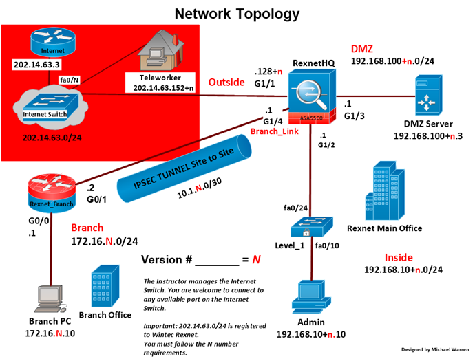

# REXNET-Architecture
Rexnet Industries is designing its network and will include two offices named: Rexnet Head Quarters and Rexnet Branch. This Architecture is to secure and configure the central network PCs and intermediary devices. 

The devices configuration in the design drawings is in the repo.
